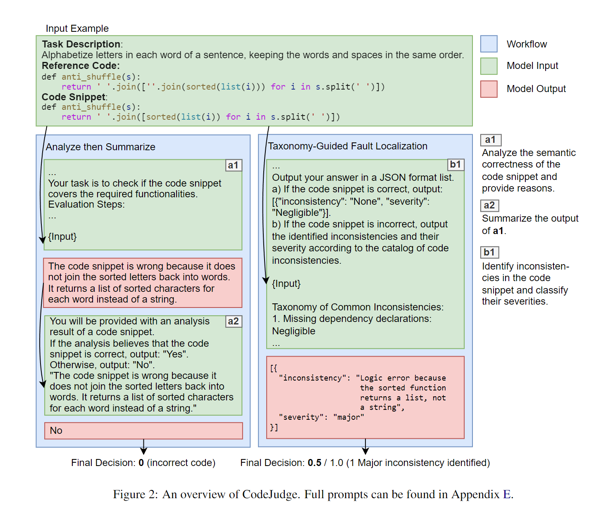
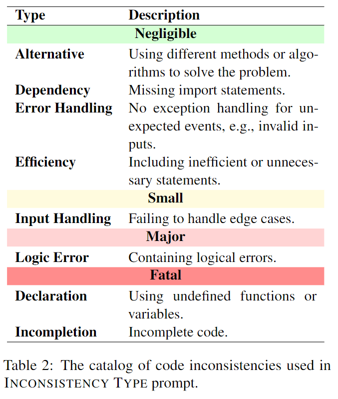

# CodeJudge 

This is the official implementation of "CodeJudge : Utilizing Large Language Model Analysis to Evaluate Code Generation".


## How does it work?



CodeJudge employs two types of prompting methods: **Inconsistency Type** and **Dual Step**, as illustrated in Figure 1.

### Dual Step
We decomposed the binary classification evaluation task into two subtasks: an *analysis* task and a *summarization* task. We first prompt LLMs to generate an analysis of the code snippet, then we make the output of LLMs as the second input and ask LLMs to determine correctness.

### Inconsistency Type



For **Inconsistency Type**, a catalog of code inconsistency and their severity is designed. **Inconsistency Type** provides LLMs with this list in the prompt and instructs them to identify and categorize the severity of the inconsistencies in the generated code. We then calculate the score based on the analysis of these inconsistencies, assigning penalties according to the severity of the identified inconsistencies.


## Installation

```shell
conda create -n codejudge_env python=3.10 -y
conda activate codejudge_env
pip install --upgrade pip
pip install -r requirements.txt
```

## Prepare Models

### GPT
```shell
export OPENAI_API_KEY=<YOUR_API_KEY>
```

### Code Llama - Instruct
1. Please follow the instructions at the [official repository](https://github.com/facebookresearch/codellama) of Code Llama to get a download URL.

2. Download the model
```
cd evaluation/model
bash download.sh
```
3. After downloading the model, you should convert the model to huggingface format.

```bash
bash convert.sh
```

## Generate Samples

1. Generate code samples with Code Llama - Instruct 13B
```shell
bash run.sh
```

2. Extract samples from .jsonl.gz files and combine them into one file
```shell
bash extract.sh
bash combine.sh
```

3. Generate code result using Dockerfile following tutorials at the [official implementation](https://github.com/THUDM/CodeGeeX/blob/main/codegeex/benchmark/README.md).

```shell
docker pull rishubi/codegeex:latest
sudo docker run -it --gpus all --mount type=bind,source="<YOUR_PATH/evaluation/generate_samples/data>",target="/data" rishubi/codegeex
```

In the docker, you should first uncomment the warning lines in `/workspace/CodeGeeX/codegeex/benchmark/execution.py`, then run the test shell:

```shell
cd /workspace/CodeGeeX
bash scripts/evaluate_humaneval_x.sh <RESULT_FILE> <LANG> <N_WORKERS>
```

Example:

```shell
bash scripts/evaluate_humaneval_x.sh /data/cpp_test.jsonl cpp 32
bash scripts/evaluate_humaneval_x.sh /data/java_test.jsonl java 32
bash scripts/evaluate_humaneval_x.sh /data/js_test.jsonl js 32
bash scripts/evaluate_humaneval_x.sh /data/python_test.jsonl python 32
bash scripts/evaluate_humaneval_x.sh /data/cpp_validation.jsonl cpp 32
bash scripts/evaluate_humaneval_x.sh /data/java_validation.jsonl java 32
bash scripts/evaluate_humaneval_x.sh /data/js_validation.jsonl js 32
bash scripts/evaluate_humaneval_x.sh /data/python_validation.jsonl python 32
```


4. Sum all data to `evaluation/data/humaneval/test_cases`

```shell
python get_dataset.py
```

## Run Experiments

### Test on the HumanEval Dataset

See [sample scripts](evaluation/humaneval/sample_script/).

### Test on the CoNaLa Dataset

See [sample scripts](evaluation/conala/sample_script/).